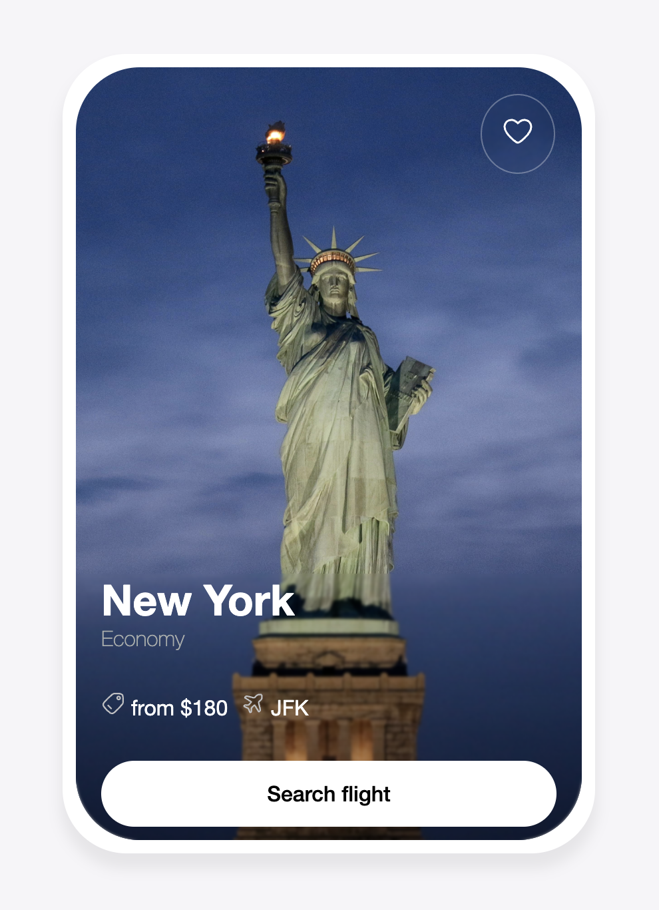

# Penguin Components

This is my personal attempt at creating good looking UI. This includes attempt at re-creating cool widgets I find online and learn the logic behind them.

## Plan

1. Card
- [x] Create a card

2. Hero section 

- [] Create a simple hero section
- [] Learn to add animations ( possible library gsap )